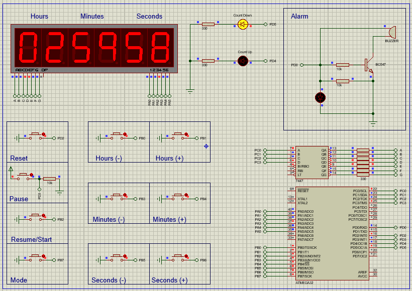

# Stopwatch with Dual Mode (Increment and Countdown) Using ATmega32 and Seven-Segment Display

Stopwatch with Dual Mode (Increment and Countdown) Using ATmega32 and Seven-Segment Display

## Objective

To design and implement a digital stopwatch with two operational modes: counting up (increment mode) and counting down (countdown mode). The project utilizes an ATmega32 microcontroller, six multiplexed seven-segment displays (common anode), and multiple push buttons for user interaction.

## Project Overview

This project involves creating a versatile stopwatch that operates in two distinct modes:
1. **Increment Mode (Default)**: The stopwatch counts upwards from zero, displaying hours, minutes, and seconds on six seven-segment displays.
2. **Countdown Mode**: The stopwatch counts downwards from a user-defined time, functioning as a countdown timer.

### Features

- **Reset Function**: Resets the time to zero in both modes.
- **Pause Function**: Pauses the time counting, allowing the stopwatch to hold its current value.
- **Resume Function**: Resumes counting from the paused time.
- **Mode Toggle**: Switches between increment and countdown modes.

### Hardware Components

- **Microcontroller**: ATmega32
- **Display**: Six multiplexed seven-segment displays (common anode) driven by a 7447 BCD to seven-segment decoder connected to the first 4 pins in PORTC.
- **Input**: 
  - **Reset Button**: Connected to PD2 (INT0) with internal pull-up resistor – Resets the stopwatch.
  - **Pause Button**: Connected to PD3 (INT1) with external pull-up resistor – Pauses the stopwatch.
  - **Resume Button**: Connected to PB2 (INT2) with internal pull-up resistor – Resumes the stopwatch.
  - **Mode Toggle Button**: Connected to PB7 – Toggles between increment and countdown modes.
  - **Hours Adjustment**:
    - Increment Hours: Connected to PB1 with internal pull-up resistor
    - Decrement Hours: Connected to PB0 with internal pull-up resistor
  - **Minutes Adjustment**:
    - Increment Minutes: Connected to PB4 with internal pull-up resistor
    - Decrement Minutes: Connected to PB3 with internal pull-up resistor
  - **Seconds Adjustment**:
    - Increment Seconds: Connected to PB6 with internal pull-up resistor
    - Decrement Seconds: Connected to PB5 with internal pull-up resistor
- **Alarm/Buzzer**: Connected to PD0 and activated when the countdown reaches zero or during specific alert conditions.
- **LED Indicators**:
  - Counting Up LED: Connected to PD4 (Red)
  - Counting Down LED: Connected to PD5 (Yellow)

### Operation Description

- **Increment Mode**: By default, the stopwatch starts in increment mode, where the time counts up continuously from zero. The time is displayed across six seven-segment displays, showing hours, minutes, and seconds. The red LED on PD4 is turned on to indicate increment mode.
- **Countdown Mode**: When the mode toggle button is pressed, the stopwatch switches to countdown mode. In this mode, the user can set the desired countdown time using the hour, minute, and second adjustment buttons. The countdown begins once the start/resume button is pressed. A yellow LED on PD5 is turned on to indicate countdown mode. An alarm is triggered when the countdown reaches zero.

### System Requirements

1. **Microcontroller**: ATmega32
2. **System Frequency**: 16MHz
3. **Timer1 Configuration**: Configure Timer1 in ATmega32 with CTC mode to count the stopwatch time.
4. **Seven-Segment Displays**: Connect six 7-segment displays using the multiplexing technique. Use one 7447 decoder for all 7-segments and control the enable/disable for each 7-segment using an NPN BJT transistor connected to one of the MCU pins.
5. **Multiplexing**: Drive one 7-segment display at a time and switch displays using transistors. Use the first 6 pins in PORTA as the enable/disable pins for the six 7-segments.
6. **Power-Up**: Stopwatch counting should start once power is connected to the MCU.
7. **External Interrupts**:
   - **INT0**: Falling edge detected to reset the stopwatch.
   - **INT1**: Rising edge detected to pause the stopwatch.
   - **INT2**: Falling edge detected to resume the stopwatch.

### Countdown Mode Setup

1. **Pause the Timer**: Ensure the timer is paused by pressing the pause button connected to PD3 (INT1).
2. **Toggle to Countdown Mode**: Use the mode toggle button connected to PB7 to switch to countdown mode.
3. **Adjust the Countdown Start Time**: Set the desired start time for the countdown using the adjustment buttons.
4. **Resume the Countdown**: Press the resume button connected to PB2 (INT2) to start the countdown.
5. **Buzzer Activation**: When the countdown reaches zero, the buzzer connected to the alarm circuit will be triggered.

### Video Demonstration

Check this video for a demonstration of the project: [Project Video](https://youtu.be/-7c2NCQg5r4)
